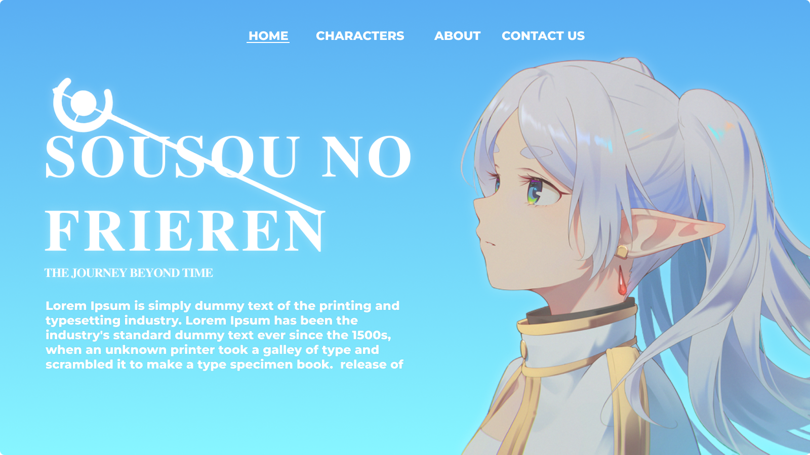
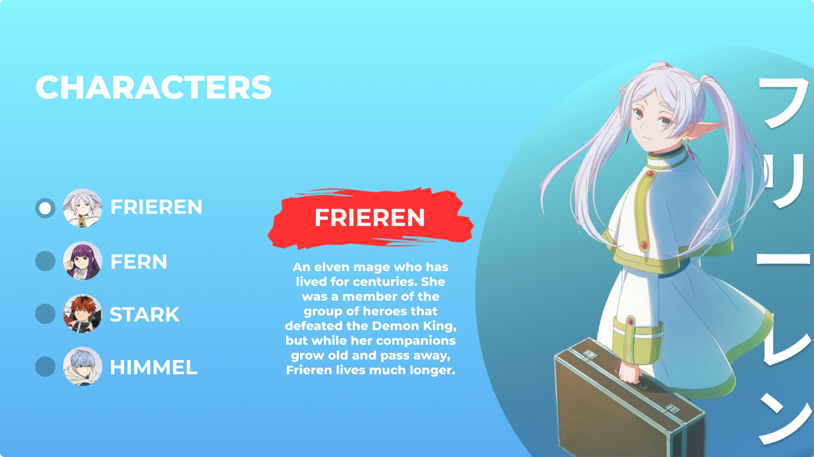
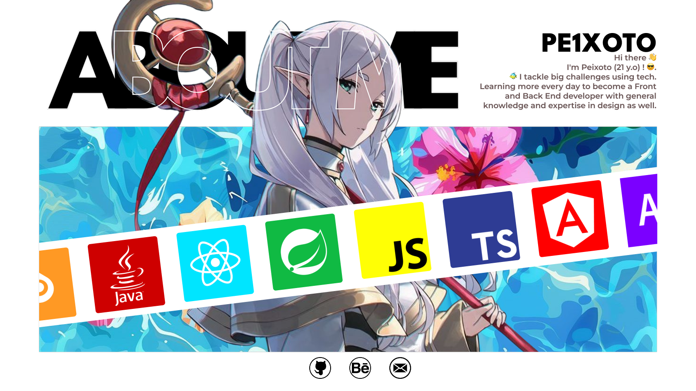

# Frieren: Beyond Journey's End - Landing Page

> This is a fan-made landing page project for the anime 'Frieren: Beyond Journey's End' (葬送のフリーレン), built to practice and showcase advanced front-end animations and layout techniques.

---

## 🚀 Live Demo

**[>> View Live Demo <<]([https://seu-usuario.github.io/seu-repositorio/](https://frieren-landing-page-5nv7kn33n-pe1xotos-projects.vercel.app/))**

---

## 📸 Previews

| Home Section | Characters Section | About Me Section |
| :---: | :---: | :---: |
|  |  |  |

---

## 📝 About The Project

I created this landing page project for "Frieren" using only **HTML, CSS, vanilla JavaScript,** and the **GSAP** library for animations. The entire design was made by me in Figma.

**⚠️ Important Viewing Note:**

This project is not very responsive, I kinda got lazy about fixing it. It was developed on a **1920x1080 (16:9)** monitor and is best viewed at a **1920x911** resolution.

Maybe I'll get around to fixing the responsiveness issues someday!

---

## 🎨 Design & Credits

* All UI/UX design was created by me from scratch in **Figma**.
* The character fanarts used in the project were sourced from public searches on Google Images. All rights and credits go to their respective original artists.
